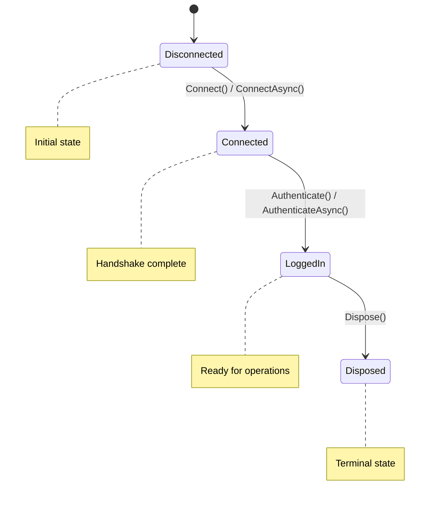

# Session Lifecycle and State Management

An SSH session progresses through distinct states from creation to disposal. Understanding these states is essential for proper session management and avoiding errors.

## Session States

The `SshSession` has four possible states:

| State | Description | What You Can Do |
|-------|-------------|-----------------|
| `Disconnected` | Initial state, no connection | Call `Connect()` or `ConnectAsync()` |
| `Connected` | TCP connected, SSH handshake complete | Call `Authenticate()` or disconnect |
| `LoggedIn` | Authenticated and ready to use | Execute commands, transfer files, configure settings |
| `Disposed` | Session terminated, resources released | Nothing - create a new session |

## State Transitions



## Checking Current State

Access the session's current state via the `ConnectionStatus` property:

```c#
var session = new SshSession();

Console.WriteLine($"Current state: {session.ConnectionStatus}");
// Output: Current state: Disconnected

session.Connect("example.com", 22);
Console.WriteLine($"Current state: {session.ConnectionStatus}");
// Output: Current state: Connected

session.Authenticate(credential);
Console.WriteLine($"Current state: {session.ConnectionStatus}");
// Output: Current state: LoggedIn

session.Dispose();
Console.WriteLine($"Current state: {session.ConnectionStatus}");
// Output: Current state: Disposed
```

## Valid Operations Per State

### Disconnected State

Operations available immediately after creating a session:

```c#
var session = new SshSession();

// Valid operations:
session.SetSecureMethodPreferences();           // Configure algorithms
session.SetMethodPreferences(method, prefs);    // Set algorithm preferences
session.Connect("example.com", 22);              // Connect to server
await session.ConnectAsync("example.com", 22);   // Connect asynchronously

// Invalid operations (will throw SshException with SshError.DevWrongUse):
session.Authenticate(credential);                // ❌ Not connected yet
session.ExecuteCommand("ls");                    // ❌ Not connected
session.SetSessionTimeout(TimeSpan.FromMinutes(5)); // ❌ Must connect first
```

### Connected State

Operations available after successful connection:

```c#
session.Connect("example.com", 22);
// Now in Connected state

// Valid operations:
session.Authenticate(credential);                      // Authenticate
await session.AuthenticateAsync(credential);           // Authenticate asynchronously
session.GetHostKey();                                  // Get server's host key
session.GetHostKeyHash(SshHashType.SHA256);           // Get host key fingerprint
session.SetSessionTimeout(TimeSpan.FromMinutes(5));   // Set operation timeout
session.DisableSessionTimeout();                       // Disable timeout
session.ConfigureKeepAlive(false, TimeSpan.FromSeconds(30)); // Configure keepalive
session.SendKeepAlive();                               // Send keepalive
session.GetNegotiatedMethod(SshMethod.Kex);           // Check algorithms

// Invalid operations:
session.ExecuteCommand("ls");                          // ❌ Must authenticate first
session.ReadFile("/path/file", stream);                // ❌ Must authenticate first
session.WriteFile("/path/file", stream);               // ❌ Must authenticate first
```

### LoggedIn State

Operations available after successful authentication:

```c#
session.Authenticate(credential);
// Now in LoggedIn state

// All operations from Connected state, plus:
session.ExecuteCommand("ls");                          // Execute commands
await session.ExecuteCommandAsync("ls");               // Execute asynchronously
session.ReadFile("/path/file", stream);                // Download files
await session.ReadFileAsync("/path/file", stream);     // Download asynchronously
session.WriteFile("/path/file", stream);               // Upload files
await session.WriteFileAsync("/path/file", stream);    // Upload asynchronously

// Note: You can still call methods from Connected state:
session.SendKeepAlive();                               // Send keepalive
session.SetSessionTimeout(TimeSpan.FromMinutes(10));  // Adjust timeout
session.GetHostKeyHash(SshHashType.SHA256);           // Still works
```

### Disposed State

Once disposed, the session is permanently unusable:

```c#
session.Dispose();
// Now in Disposed state

// All operations are invalid
session.Connect("example.com", 22);    // ❌ Cannot reuse
session.ExecuteCommand("ls");           // ❌ Disposed
```

> **Important**: You cannot reconnect a disposed session. Create a new `SshSession` instance instead.

## Proper Session Management

### Using Statement (Recommended)

The best way to ensure proper cleanup:

```c#
using var session = new SshSession();
session.Connect("example.com", 22);
session.Authenticate(credential);

var result = session.ExecuteCommand("ls");
Console.WriteLine(result.Stdout);

// Automatically disposed when leaving scope
```

### Try-Finally Pattern

Explicit disposal in exception scenarios:

```c#
var session = new SshSession();
try
{
    session.Connect("example.com", 22);
    session.Authenticate(credential);

    var result = session.ExecuteCommand("ls");
    Console.WriteLine(result.Stdout);
}
catch (SshException ex)
{
    Console.WriteLine($"Error: {ex.Message}");
}
finally
{
    session.Dispose(); // Always cleanup
}
```

### Manual Disposal

Explicit disposal when needed:

```c#
var session = new SshSession();
session.Connect("example.com", 22);
session.Authenticate(credential);

// Do work...

session.Dispose(); // Explicit cleanup
```

## State Validation

The library automatically validates that operations are called in the correct state:

```c#
var session = new SshSession();

try
{
    // Try to execute command before connecting
    session.ExecuteCommand("ls");
}
catch (SshException ex) when (ex.Error == SshError.DevWrongUse)
{
    Console.WriteLine("Operation not allowed in current state");
    Console.WriteLine($"Current state: {session.ConnectionStatus}");
}
```

## Complete Lifecycle Example

```c#
using NullOpsDevs.LibSsh;
using NullOpsDevs.LibSsh.Credentials;
using NullOpsDevs.LibSsh.Exceptions;

public class SessionLifecycleDemo
{
    public void DemonstrateLifecycle()
    {
        // 1. Create session (Disconnected state)
        var session = new SshSession();
        Console.WriteLine($"1. Created: {session.ConnectionStatus}");

        try
        {
            // 2. Configure before connecting (Disconnected state)
            session.SetSecureMethodPreferences();
            Console.WriteLine("2. Configured algorithm preferences");

            // 3. Connect (Disconnected → Connected)
            session.Connect("example.com", 22);
            Console.WriteLine($"3. Connected: {session.ConnectionStatus}");

            // 4. Post-connection configuration (Connected state)
            session.SetSessionTimeout(TimeSpan.FromMinutes(5));
            session.ConfigureKeepAlive(false, TimeSpan.FromSeconds(30));
            Console.WriteLine("4. Configured session parameters");

            // 5. Verify host key (Connected state)
            var hostKey = session.GetHostKey();
            Console.WriteLine($"5. Host key type: {hostKey.Type}");

            // 6. Authenticate (Connected → LoggedIn)
            var credential = SshCredential.FromPassword("user", "password");
            bool authenticated = session.Authenticate(credential);

            if (!authenticated)
            {
                Console.WriteLine("6. Authentication failed");
                return;
            }

            Console.WriteLine($"6. Authenticated: {session.ConnectionStatus}");

            // 7. Use the session (LoggedIn state)
            var result = session.ExecuteCommand("whoami");
            Console.WriteLine($"7. Executed command: {result.Stdout.Trim()}");

            // 8. Transfer files (LoggedIn state)
            using (var stream = File.OpenRead("local-file.txt"))
            {
                session.WriteFile("/tmp/uploaded-file.txt", stream);
            }
            Console.WriteLine("8. Uploaded file");

            // 9. More commands (LoggedIn state)
            result = session.ExecuteCommand("ls /tmp");
            Console.WriteLine($"9. Listed directory:\n{result.Stdout}");
        }
        catch (SshException ex)
        {
            Console.WriteLine($"SSH Error: {ex.Message}");
            Console.WriteLine($"Current state: {session.ConnectionStatus}");
        }
        finally
        {
            // 10. Cleanup (Any state → Disposed)
            session.Dispose();
            Console.WriteLine($"10. Disposed: {session.ConnectionStatus}");
        }
    }
}
```

## Best Practices

1. **Always dispose sessions**:
   ```c#
   using var session = new SshSession(); // Automatic disposal
   ```

2. **Configure before connecting**:
   ```c#
   session.SetSecureMethodPreferences(); // Before Connect()
   session.Connect("example.com", 22);
   ```

3. **Check authentication result**:
   ```c#
   if (!session.Authenticate(credential))
   {
       Console.WriteLine("Authentication failed");
       return; // Don't proceed
   }
   ```

4. **Handle state errors gracefully**:
   ```c#
   try
   {
       session.ExecuteCommand("ls");
   }
   catch (SshException ex) when (ex.Error == SshError.DevWrongUse)
   {
       Console.WriteLine($"Invalid state: {session.ConnectionStatus}");
   }
   ```

5. **Don't reuse disposed sessions**:
   ```c#
   var session = new SshSession();
   session.Dispose();
   // session is now unusable - create a new one
   session = new SshSession();
   ```

6. **Use async methods for UI applications**:
   ```c#
   await session.ConnectAsync("example.com", 22);
   await session.AuthenticateAsync(credential);
   var result = await session.ExecuteCommandAsync("ls");
   ```

## State Transition Errors

### Connecting when already connected

```c#
session.Connect("example.com", 22);
session.Connect("other-host.com", 22); // ❌ Throws DevWrongUse
```

**Solution**: Dispose and create new session to connect elsewhere.

### Operating on disposed session

```c#
session.Dispose();
session.ExecuteCommand("ls"); // ❌ Throws DevWrongUse
```

**Solution**: Check state before operations or create new session.

### Authenticating twice

```c#
session.Authenticate(credential);
session.Authenticate(credential); // ❌ Throws DevWrongUse
```

**Solution**: Authentication only happens once per connection.

## Session Reuse Pattern

For multiple operations, reuse the session:

```c#
using var session = new SshSession();
session.Connect("example.com", 22);
session.Authenticate(credential);

// Reuse for multiple operations
for (int i = 0; i < 10; i++)
{
    var result = session.ExecuteCommand($"echo {i}");
    Console.WriteLine(result.Stdout);

    // Session stays in LoggedIn state
    Console.WriteLine($"State: {session.ConnectionStatus}");
}

// Still in LoggedIn state
session.WriteFile("/tmp/data.txt", stream);
```

## State Persistence

State persists across operations:

```c#
session.Connect("example.com", 22);
// State: Connected

session.SetSessionTimeout(TimeSpan.FromMinutes(5));
// Still: Connected

session.Authenticate(credential);
// State: LoggedIn

session.ExecuteCommand("ls");
// Still: LoggedIn

session.SendKeepAlive();
// Still: LoggedIn

// State only changes with Connect(), Authenticate(), or Dispose()
```

## Async State Management

Async methods follow the same state rules:

```c#
var session = new SshSession();

// Disconnected → Connected
await session.ConnectAsync("example.com", 22);

// Connected → LoggedIn
await session.AuthenticateAsync(credential);

// LoggedIn operations
var result = await session.ExecuteCommandAsync("ls");
var downloaded = await session.ReadFileAsync("/path", stream);

// Dispose (synchronous)
session.Dispose();
```

## See Also

- `SshConnectionStatus` enum (SshConnectionStatus.cs:6) - Session state enumeration
- `SshSession.ConnectionStatus` property (SshSession.cs:36) - Current session state
- [Error Handling](error-handling.md) - Handling state-related errors
- [Session Timeouts](session-timeouts.md) - Configuring session timeouts
- [Authentication](authentication.md) - State transitions during authentication
